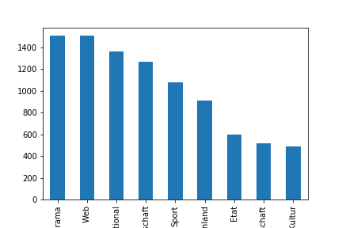
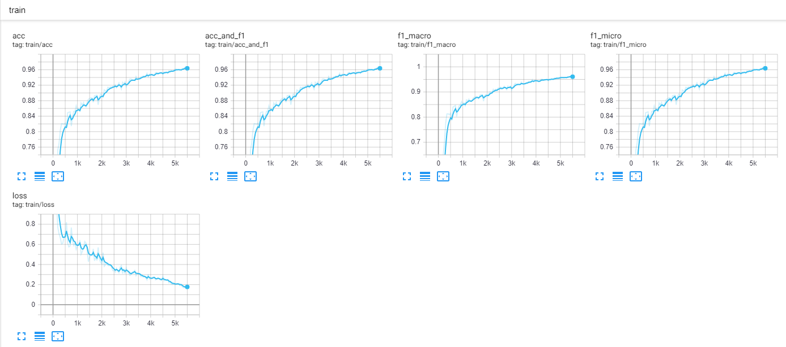
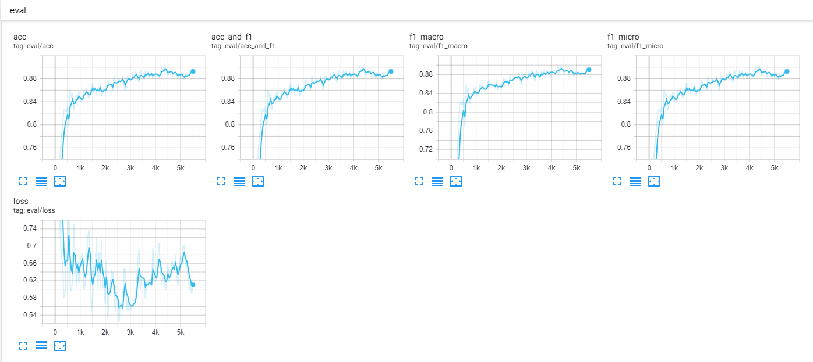

# Experiments with "Bidirectional Encoder Representation from Transformers" (BERT)

Exploration of the inner working by fine-tuning a BERT encoder on the 10KGNAD dataset 

## Dataset
The training data is based on the 
 "Ten Thousand German News Articles Dataset for Topic Classification https://tblock.github.io/10kGNAD/"
 
```
git clone https://github.com/tblock/10kGNAD.git
```

### Class distribution of dataset



## Model training

Hyper params:

```
{
  "attention_probs_dropout_prob": 0.1,
  "finetuning_task": null,
  "hidden_act": "gelu",
  "hidden_dropout_prob": 0.1,
  "hidden_size": 768,
  "initializer_range": 0.02,
  "intermediate_size": 3072,
  "layer_norm_eps": 1e-12,
  "max_position_embeddings": 512,
  "num_attention_heads": 12,
  "num_hidden_layers": 12,
  "num_labels": 9,
  "output_attentions": false,
  "output_hidden_states": true,
  "torchscript": false,
  "type_vocab_size": 2,
  "vocab_size": 30000
}

```

#### Results

```
acc = 0.8929961089494164
acc_and_f1 = 0.8929961089494164
f1_macro = 0.8902614321693273
f1_micro = 0.8929961089494164
loss = 0.6125384846398997
```






